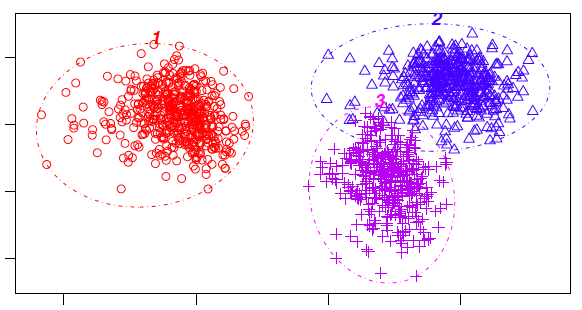
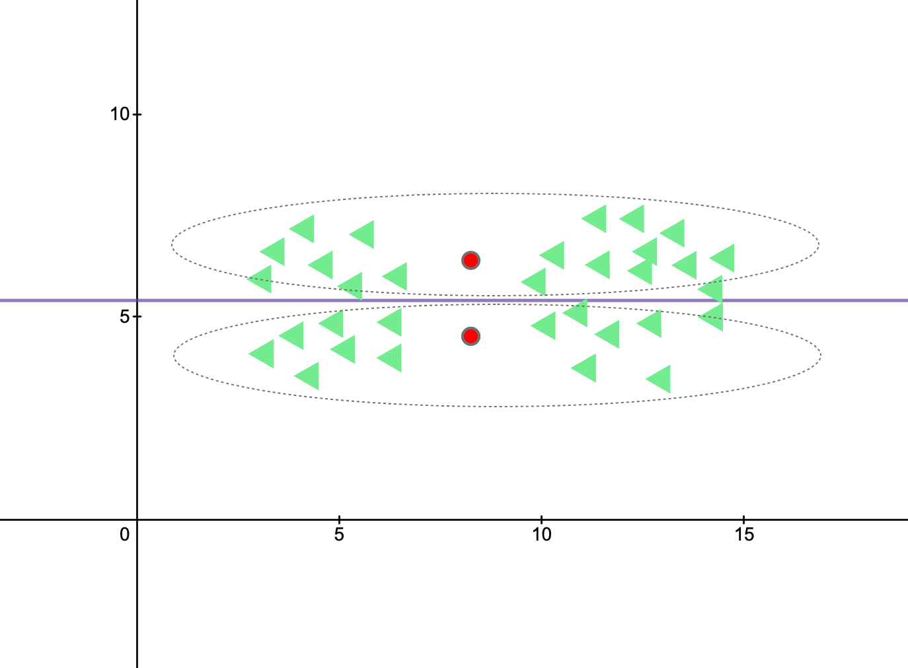

# K-Means Clustering (Unsupervised Learning)

K-Means Clustering | Example code and own notes while taking 
the course "Intro to Machine Learning" on Udacity.

## Steps

1. It generates 3 (or n) different random points.
2. Assign them the closest points.
3. Optimize them each step. 
4. They will be centered after optimization rounds.

## scikit-learn - important parameters

All the values below are set by default:

- `n_clusters` = 8
- `max_iter` = 300
- `n_init` = 10 (Number of different initializations that you give it. How many times does it initialize the algorithm`)

## Local minimum

If the initial centers are like this, it would be a bad local minumum. You have reinit the algorithm to prevent this problem.
